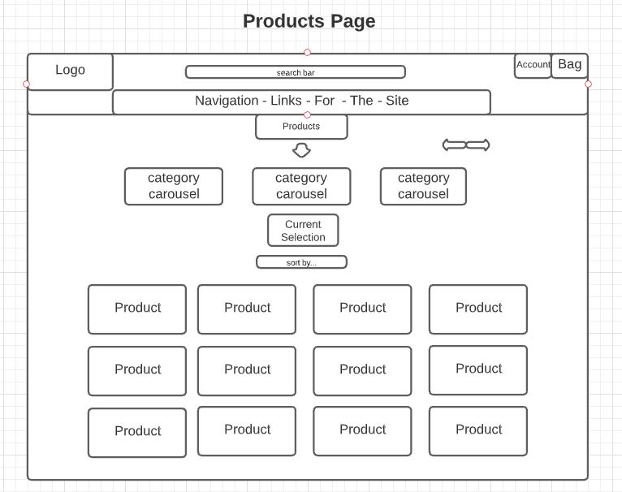
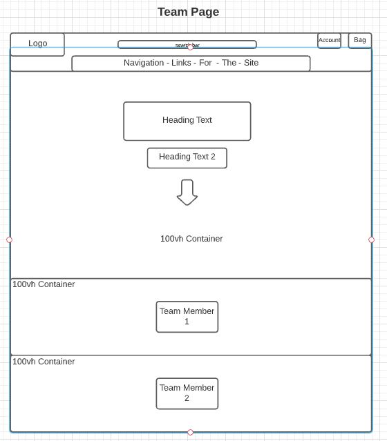
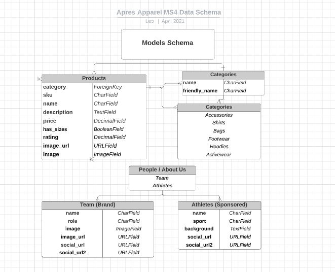
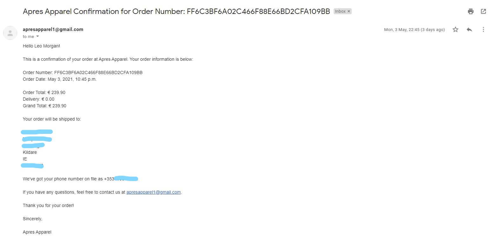
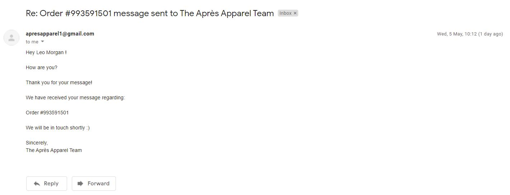
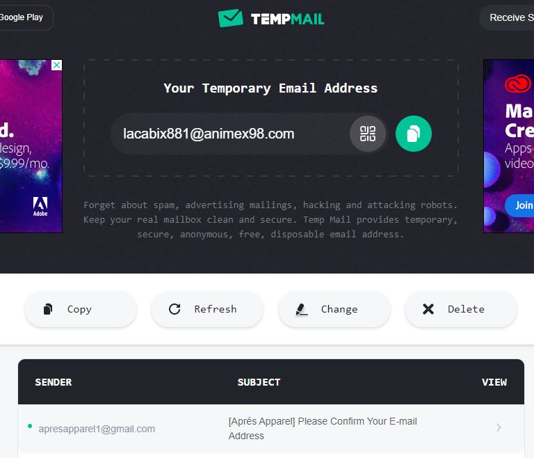

# <a href="https://apres-apparel.herokuapp.com/">Après Apparel</a>


This [project](https://apres-apparel.herokuapp.com/) is my fourth milestone project (Full Stack Frameworks with Django) in Full Stack Software Development course run by [Code Institute](https://codeinstitute.net/)

Après Apparel is an outdoor lifestyle brand founded by my friend, Stephen Rice, with the main aim of manifesting a positive brand image & culture amongst those who lead active lifestyles whilst also supplying apparel & accessories to suit 
those lifestyles.
The approach of this business relies heavily on creating community & a culture around the brand and team members, rather than being detached and strictly ecommerce for products.
The Après Apparel vision is to build a strong following around the brand & its values on social media & to hopefully use that platform to give back and support that community.

---

## Table of Contents
1. [**UX**](#ux)
    - [**User Stories**](#user-stories)
    - [**Design**](#design)
        - [**Framework**](#framework)
        - [**Color Scheme**](#color-scheme)
        - [**Icons**](#icons)
        - [**Typography**](#typography)
    - [**Wireframes**](#wireframes)

2. [**Features**](#features)
    - [**Existing Features**](#existing-features)
    - [**Features Left to Implement**](#features-left-to-implement)

3. [**Technologies Used**](#technologies-used)
    - [**Version Control & Project Management**](#version-control)
    - [**Front-End Technologies**](#front-end-technologies)
    - [**Back-End Technologies**](#back-end-technologies)
    - [**Tools**](#tools)
    - [**Resources**](#resources)

4. [**Testing**](#testing)
    - [**Validators**](#validators)
    - [**Compatibility**](#compatibility)
    - [**Known Issues**](#known-issues)

5. [**Deployment**](#deployment)
    - [**Local Deployment**](#local-deployment)
    - [**Remote Deployment**](#remote-deployment)

6. [**Credits**](#credits)
    - [**Content**](#content)
    - [**Media**](#media)
    - [**Code**](#code)
    - [**Acknowledgements**](#acknowledgements)

---

## UX

This project is part of my [Code Institute](https://codeinstitute.net/) Full Stack Software Development Diploma Course, specifically the **Full Stack Frameworks** module.
The objective for this project is to "Create a web application that allows users to browse & purchase products, register/login/logout & provide delivery information securely, display team members behind the brand & real athletes we wish to support in future." 

This e-commerce site is made for those who love adventuring, sports and the outdoors!
We also have a section dedicated to athletes we support & follow, and the team members behind the Après Apparel brand, with social media links provided
for any curious visitors to site to check out.
I have placed a big emphasis on buttons to navigate each pages layout which is subsequently made up of sections that are 100vh(view height) on all devices, button clicks allows the user to navigate to the next available section intuitively & smoothly as smooth-scrolling is enabled for all HTML elements in my static CSS files.

### User Stories

"**_As a user, I would like to_** _____________________________"

:white_check_mark: *denotes items that have been successfully implemented*

- :white_check_mark: *view the site* from **any device** *(mobile, tablet, desktop)*.
- :white_check_mark: *view all products* as a **Guest** and **Registered User**.
- :white_check_mark: *view individual product details* as a **Guest** and **Registered User**.
- :white_check_mark: *add products to my shopping bag* as a **Guest** and **Registered User**.
- :white_check_mark: *remove products from my shopping bag* as a **Guest** and **Registered User**.
- :white_check_mark: *manage products in my shopping bag* as a **Guest** and **Registered User**.
- :white_check_mark: *sort/order products* by **name, category, price, rating**.
- :white_check_mark: *search products* by **name, category, description**.
- :white_check_mark: **limit** the number of *products* to display by name (alphabetical sorting), product category type, or see *all products*.
- :white_check_mark: *create* my **own profile** with secure email verification as a **User**.
- :white_check_mark: *update* & *manage* my **email address, password, delivery information** as a **Registered User**.
- :white_check_mark: *view* **bag subtotal** whilst browsing the store as a **Guest/User**.
- :white_check_mark: *view* **bag contents** whilst browsing the store as a **Guest/User**.
- :white_check_mark: *add* **products** as a **Store Owner/Admin**.
- :white_check_mark: *edit* **products** as a **Store Owner/Admin**.
- :white_check_mark: *delete* **products** as a **Store Owner/Admin**.
- :white_check_mark: be able to **log out**.

**General**  
- :white_check_mark: *view the site* from **any device** *(mobile, tablet, desktop)*.
- :white_check_mark: *I want to immediately understand the purpose of the site*
- :white_check_mark: *I want to be able to easily navigate through the site*
- :white_check_mark: *I want a site that is visually simplistic*
- :white_check_mark: *I want to know where I am on the site at any time*
- :white_check_mark: *I want to be informed of actions I make and whether they are successful or not*

**Products**   
- :white_check_mark: *I want to see a list of available products*
- :white_check_mark: *I want products to be sorted into relevant categories*
- :white_check_mark: *I want to be able to search the site for a specific product*
- :white_check_mark: *I want to be able to view the individual product details*
- :white_check_mark: *I want to be able to select the size of a product*
- :white_check_mark: *I want to be able to adjust the quantity of a product*

**Athletes**   
- :white_check_mark: *I want to see a list of sponsored athletes*
- :white_check_mark: *I want to be able to see what sport the athlete plays*
- :white_check_mark: *I want to be able to view the individual athlete details*
- :white_check_mark: *I want to be able to connect with an specific athlete via social media*

**Team** 
- :white_check_mark: *I want to be able to see who is behind the brand*
- :white_check_mark: *I want to be able to see which roles each team member has in relation to the brand*
- :white_check_mark: *I want to be able to connect with a specific team member via social media*
- :white_check_mark: *I want to be able to view the individual team member details*

**Shopping Bag**  
- :white_check_mark: *I want to easily view my shopping bag*
- :white_check_mark: *I want to easily view my bag total*
- :white_check_mark: *I want to easily view my bag total from anywhere on the site*
- :white_check_mark: *I want to be able to remove items from my shopping bag*
- :white_check_mark: *I want to be able to adjust the quantity of items in my shopping bag*
- :white_check_mark: *I want to see any changes I make to my bag reflected in the bag totals*
- :white_check_mark: *I want to view the details of what is in my bag*

**Checkout**  
- :white_check_mark: *I want to be able to checkout securely*
- :white_check_mark: *I want to receive a confirmation of my order on site*
- :white_check_mark: *I want the confirmation of my order to include the details of my order*

**Account**   
- :white_check_mark: *I want to be able to create an account*
- :white_check_mark: *I want to be able to see the order history for my account*

#### **As a Registered User:** 
- :white_check_mark: *I want to be able to log in and out easily*
- :white_check_mark: *I want to be able to reset my password*
- :white_check_mark: *I want to receive confirmation that I have registered for the site*
- :white_check_mark: *I want to have a personal profile*
- :white_check_mark: *I want to be able to view my order history*
- :white_check_mark: *I want to be able to save my default delivery details*
- :white_check_mark: *I want to be able to easily update my delivery information*

#### **As a Superuser or Store Owner:**
- :white_check_mark: *I want to be able to access the admin panel*
- :white_check_mark: *I want to be able to add/edit/delete categories*
- :white_check_mark: *I want to ba able to add/edit/delete subcategories*
- :white_check_mark: *I want to be able to add new products*
- :white_check_mark: *I want to be able to add new athletes*
- :white_check_mark: *I want to be able to add new team members*
- :white_check_mark: *I want to be able to edit/delete existing products*
- :white_check_mark: *I want to be able to edit/delete existing athletes*
- :white_check_mark: *I want to be able to edit/delete existing team members*
- :white_check_mark: *I want to be able to view/manage users of the site*
- :white_check_mark: *I want to be able to view/manage orders*


### Design 

- The design of the Après Apparel website is a monochromatic Black/White/Grey color scheme to fit in line with a simple high contrast aesthetic, with various star/sunset background images used across the site to 
symbolize the outdoor lifestyle the brand wishes to promote.
- I personally prefer to create my websites with a light/dark theme and avoid brighter colours as I feel it can impede on readability for the user.
- I wanted the website to have a simplistic high contrast colour scheme.
- I wanted the website to be intuitive and easy to navigate.
- I wanted to achieve a clean, uncluttered aesthetic.
- I wanted the website to be accessible & responsive on all modern devices (desktop, mobile, tablet).
- I wanted a button scheme for users to easily navigate with a tap to different div sections (100vh/view height) on single pages.

#### Frameworks

- [Bootstrap 4.6.0](https://getbootstrap.com/)
    - My preferred CSS framework for this project because of the simple-to-understand documentation & simplicity of use.
- [jQuery 3.6.0](https://code.jquery.com/jquery/)
    - In an effort to keep the JavaScript minimal, I have decided to use jQuery as foundation to my scripts framework.
- [Django 3.1.0](https://www.djangoproject.com/download/)
    - Django is a free and open-source web framework that I've used to render the back-end Python with the front-end Bootstrap4 CSS3 Framework and AnimateCSS Library. 

#### Color Scheme

- As I favour simplicity & high contrast over popping colours when designing website, the color scheme used for this website is a simple Black/White/Grey monochromatic theme.

-  `#fff`
-  `#696969`
-  `#000`

My main reason for a basic white/grey/black monochromatic color scheme is that it provides high contrast between text & background elements which makes readability easier for visitors who visit the site.
I've been inspired in the past by tech giant Apple's UX, where they favour simplicity, subtle animations & grayscale monochromatic color schemes.
This particular color scheme also fits in with the simple aesthetic the brand owner of Après Apparel is trying to achieve.

White is the predominant theme of the website with black being reserved for button outlines & texts for extra readability.
The white background also helps the product images pop out visually for the site visitors as they are mostly bright & colourful.

#### Icons

- [Font Awesome 5.15.3](https://fontawesome.com/)
    - Font Awesome was my preferred source for icon use across the site rather than Materialize Icons. Font Awesome Icons are simplistic & easily customizable and displayed through *classes* rather than *text*
    which fits the aesthetic Après Apparel is targetting.

#### Typography

- [Google Fonts](https://fonts.google.com/) were used across the site:
- [Montserrat](https://fonts.google.com/specimen/Montserrat#standard-styles) : default font.
- [AnimateCSS](https://animate.style/) : Animations used for heading on landing, team & athlete page.
- [Bootstrap](https://getbootstrap.com/) : Typography / Colors Documentation from Bootstrap was used in various headings/texts/alerts around the site such as ".display-x" & ".text-success" classes.


#### Wireframes

[Lucid App](https://lucid.app/lucidchart/) - Used for for wireframes & to visualize data schema models.

- Home Page


- Product Page



- Team Page



- AA Models Schema



##### back to [top](#table-of-contents)

#### Features
 
### Existing Features
- The site contains 7 separate custom apps. Each app has its own features & unique content.
    - Home
    - Products
    - Bag
    - Checkout
    - Athletes
    - Team
    - Profile 

**Register Account** 
- Anybody can register for free and create their own unique account. There is built-in authentication and authorization to check certain criteria is met before an account is validated. All passwords are hashed for security purposes!

**Log In to Account**
- Log in to existing account securely with Allauth (Django Integrated set of Applications) that addresses sewcure authentication, registration, email confirmation & account management.

**Manage Account**
- Existing users are able to manage details associated with that account such as adding/updating delivery information, account password and primary emails.

**Log Out of Account**
- Existing users can choose to log out if they are finished using the website. 

**View all Products**
- Both registered users & guests can view all existing products available on the site. 

**Search all Products**
- Both registered users & guests can search existing products available on site via search bar on desktop view & mobile.

**Filter Products**
- Both registered users & guests can filter existing products available on site by name, sizes, price, category, rating.

**Manage Products**
- Registered users can view account order history & all associated information such as date/price/item/qty/order number. They can also manage any items in their shopping bag.

**Add Products**
- [CRUD] Store Owners / Superusers can add new products to the website or update/delete current products or athletes/team members. Certain defensive programming measures have been implemented such as granting adding/editing/deleting permissions to registered superusers/store owners only and having the /add/ directory only available to users logged in to verify if they're a superuser.

**Admin**
- Django Admin application that allows superusers / store owners to manually create, update or delete any existing models or products from the store.

**About Us**
- Section designated to showcasing sponsored athletes & the team behind the Après Apparel brand and their respective social media links.

**Toast Messages**
- Site wide feature that gives users feedback on if the action they performed was successful/unsuccessful with correlating colors.

- There are 4 types of toast messages:
    - Success (Green)
    - Info  (Blue)
    - Warning (Yellow)
    - Error (Red)

**Automated Emails**
- Automated emails are sent to the user when certain actions are performed.
    - Account verification email when a user registers for an account.
    - Password reset email.
    - Order confirmation email when a user completes an order.

- Order Confirmation

    - 

- Contact App Message Confirmation (Local Version Only)

    - 

- Email Signup Verifcation using [Temp Mail](https://temp-mail.org/id/API)

    - 


### Features Left To Implement

**Additional Products & Categories**

- Add more product models & category models to the website. 
- Add carousel images to each product to aid user in better decision making when purchasing.
- More products specific to surfing, hiking, mountain climbing, skiing.

**Contact Page & Newsletter Signup**

- Add an onsite method for guests & registered users to contact the store owners / admin.
    - I have actually successfully implemented this feature on my localhost server using 2FA authentication with gmail. However after the project was deployed to production on Heroku, I have
    had issues with models created after deployment migrating to django correctly - which results in a *Server Error: 500* on the message post request being sent from contact app views.py file.
    - Due to time constraints, I have left it out on this version of the project.

**Upcoming Events**

- Add an event application feature which displays upcoming sporting events, sales & social events for users visiting the online store.
    - Inform the user of the nature of event, time & location.
    - Add payment portal for tickets to speicific events.

##### back to [top](#table-of-contents)

### Technologies Used

### Version Control & Project Management

- [Git](https://git-scm.com/) - Primary version control for pushing/pulling code to & from my online repository.

- [GitPod](https://www.gitpod.io/) - Used as my primary IDE for developing projects.

- [GitHub](https://github.com/) - Used as remote storage of my projects online.


### Front-End Technologies


- [HTML5](https://developer.mozilla.org/en-US/docs/Web/Guide/HTML/HTML5) - Used as the base for markup text.

- [CSS3](https://developer.mozilla.org/en-US/docs/Web/CSS/CSS3) - Used as the base for cascading styles.

- [jQuery 3.4.1](https://code.jquery.com/jquery/) - Used as the primary JavaScript functionality.

- [Bootstrap 4.6.0](https://getbootstrap.com/) - Used as the front-end framework for layout and design.

- [Stripe API](https://stripe.com/docs/api?lang=python) - Used to implement secure payments.

- [Amazon AWS S3](https://aws.amazon.com/) - Used to store *staticfiles* and *media* folders and files.

### Back-End Technologies


- [Python 3.6.7](https://www.python.org/) - Used as the back-end programming language.

- [Django 2.2.16](https://docs.djangoproject.com/en/2.2/) - Used as my Python web framework.

- [Heroku](https://www.heroku.com) - Used for *"Platform as a Service"* (PaaS) for app hosting.

- [PostgreSQL 9.6](https://www.postgresql.org/) - Used as relational SQL database plugin via Heroku.

### Tools 

- [Chrome DevTools](https://developers.google.com/web/tools/chrome-devtools) - Allowed me to use browser as an editor for experimental style changes.

- [Am I Responsive](http://ami.responsivedesign.is/) - Check responsiveness of website.

- [Lighthouse](https://developers.google.com/web/tools/lighthouse) - Automated tool to audit websites performance, accessibility, SEO & best practices.

### Resources

- [Django Docs](https://docs.djangoproject.com/en/3.2/)
- [cdnjs](https://cdnjs.com/)
- [w3schools](https://www.w3schools.com/) 
- [Stack Overflow](https://stackoverflow.com/)
- Boutique Ado Project - [Code Institute](https://codeinstitute.net/) Full Stack Frameworks Module
    
The environment dependencies/ requirements for this project are shown below :


##### back to [top](#table-of-contents)

### Testing

A thorough mix of automated and manual testing have gone into building this project. 
In addition to tests, I have used online code validation sites for the code in this project. 
I have also checked compatibility of the site across various modern browsers and devices.

- Automated Testing 
    - Chrome Dev Tools Audit reports
    - HTML, CSS, JS, Python Code Validators
    - Testing for screen responsiveness using Chrome Dev Tools.

- Manual Testing
    - Manually testing for website bugs on various different devices (Phone, Tablet, Desktop.)
    - Payment testing using Stripe Webhooks.
    - Manually testing responsiveness on physical devices (Phone, Tablet, Desktop.)
    - Email Confirmation & Signup Verification using "https://temp-mail.org/en/"


#### Validators


**HTML**

- [W3C HTML Validator](https://validator.w3.org)
    - I have run all **21 files in this project through an online HTML validator.
    - **3 .html files contained minor issues that have since been rectified - taking out unused h4 headings. [Correction Commit: d4eec8e](https://github.com/Shadyxstep/apres-apparel-MS4/commit/d4eec8eeb85a53bdb29b29875f38028479dace3c)
    - The remaining validation issues are all attributed to Django Templating not being recognized by W3C:
        - **Warning**: Consider adding a `lang` attribute to the `html` start tag to declare the language of this document.
        - **Error**: Non-space characters found without seeing a doctype first. Expected `<!DOCTYPE html>`.
        - **Warning**: This document appears to be written in English. Consider adding `lang="en"` (or variant) to the `html` start tag.
        - **Error**: Element `head` is missing a required instance of child element `title`.


**CSS**

- [W3C CSS Validator](https://jigsaw.w3.org/css-validator/)
    - The W3C Jigsaw validator shows Bootstrap4 2 errors coming from URI: *"https://cdn.jsdelivr.net/npm/bootstrap@4.6.0/dist/css/bootstrap.min.css"*
    The errors are:
        - abbr[data-original-title], abbr[title] -> "Property text-decoration-skip-ink doesn't exist : none"
        - .accordion -> "Property overflow-anchor doesn't exist : none"
        
    - The W3C Jigsaw validator does not yet recognize elements imported in from the AnimateCSS library used in this project, and therefore passes 34 **Parse Errors**. The elements from AnimateCSS in my landing page headings are not recognized by the CSS Validator. The Parse Errors I've received are:
        - 

    - I also received these **Warnings** which are all coming from the validator not recognizing vendor extensions from Bootstrap4 and AnimateCSS:

        - Some of the warnings from AnimateCSS extensions
        - `--animate-duration` is an unknown vendor extension
        - `--animate-delay` is an unknown vendor extension.
        - `--animate-repeat` is an unknown  vendor extension.
        - `-webkit-animation-duration` is an unknown vendor extension.
        - `-webkit-animation-fill-mode` is an unknown vendor extension.

        - Some of the warnings from the Bootstrap4 extensions
        - `--blue` is an unknown vendor extension
        - `--indigo` is an unknown vendor extension
        - `--purple` is an unknown vendor extension
        - `--pink` is an unknown vendor extension
        - `--red` is an unknown vendor extension


**JavaScript**

- [JShint](https://jshint.com/)
    - **Stripe.js** - [stripe_elements.js File](https://github.com/Shadyxstep/apres-apparel-MS4/blob/d4eec8eeb85a53bdb29b29875f38028479dace3c/checkout/static/checkout/js/stripe_elements.js)
        - The javascript for strip_elements was taken from Stripe Documentation.
        - Minor errors include:
            -	*template literal syntax' is only available in ES6 (use 'esversion: 6').*
            -   *Missing semicolon*
            -   *'$' is not defined.*
            -   *'Stripe' is not defined.*

    - 


    - **Scripts** -
        - The rest of my JS code are jQuery scripts located at the bottom of various HTML pages. These scripts include:
            - Toast Messages alerting the user whether an action they took was successful/unsuccessful.
            - Button on bottom right that allows users to navigate back to top of the current page with a click.
            - Updating quantity of items using 

        - No major errors found in any of the script code, however these warnings showed up relating to the syntax of `<script type=text/javascript>`.
            - Those errors are shown below.
        
        - 

**Python**

- [PEP8 Online](http://pep8online.com/)
    - All **58 .py** files tested.
    - Entirely **PEP8 compliant** with one exception:
        - `settings.py` [file](project/main/settings.py) (the built-in Django settings file has a known issue, but is acceptable to not force a line break - I have tested these lines to be pep8 compliant and it caused errors in signup form password validation.)
        - *line too long (>79 characters)* -  `AUTH_PASSWORD_VALIDATORS = [{}]` x4


### Compatibility

To ensure a broad range of users can successfully use the site, I tested it across the 5 major browsers in both desktop and mobile configuration throughout the development of the project.

- **Chrome** 
- **Edge** 
- **Firefox** 
- **Safari** 
- **Opera** 

#### Screen Sizes

Using Google Chrome [DevTools](https://developers.google.com/web/tools/chrome-devtools) profiles:
- **Moto G4**
- **Galaxy S5**
- **Pixel 2/ 2XL**
- **iPhone 5/SE**
- **iPhone 6/7/8** 
- **iPhone 6/7/8 Plus** 
- **iPhone X**
- **iPad / Pro**
- **Surface Duo**
- **Galaxy  Fold**

I also physically tested the website across multiple of my own devices.
- Large desktop (2000px)
- Laptop (1600px)
- Large Mobiles (425px)
    - OnePlus 6T
    - OnePlus 8T
    - iPhone X

In addition to manually testing responsiveness on various devices, I also seeked out reviews from friends & team members behind the brand in order for them to point out
any issues they experienced when visiting the site.
As a result of this, I rectified any responsive issues throughout development by resizing and adding elements to media queries.

#### Chrome's DevTools Audit Report

- [Lighthouse](https://chrome.google.com/webstore/detail/lighthouse/blipmdconlkpinefehnmjammfjpmpbjk) - generated the below reports:

- Performance
    - "Once Lighthouse is done gathering the performance metrics (mostly reported in milliseconds), it converts each raw metric value into a metric score from 0 to 100 by looking where the metric value falls on its Lighthouse scoring distribution. The scoring distribution is a log-normal distribution derived from the performance metrics of real website performance data on [HTTP Archive](https://httparchive.org/)."

- Accessibility 
    - "These checks highlight opportunities to improve the accessibility of your web app. Only a subset of accessibility issues can be automatically detected so manual testing is also encouraged."

- Best Practices 
    - "Analyzes whether HTTPS and HTTP/2 are used, checks to see whether resources come from secure sources and assesses the vulnerability of JavaScript libraries. Other best practices look at secure database connections and avoiding the use of non-secure commands, such as document."

- SEO
    - "These checks ensure that your page is optimized for search engine results ranking. There are additional factors Lighthouse does not check that may affect your search ranking."

**Home Page**


**Products Page**


**Teams Page**


**Athletes Page**


- As you can see from the above performance ratings of the site (from ), 'performance' score was the lowest across the pages as a result of the imported AnimateCSS classes.
    - Whilst not enitrely ideal, the website has run fine on devices I used to manually test the site so I am happy to sacrifice a few fractional seconds of performance loading time for the visual effect I was trying to achieve on each pages landing titles.

- I will attempt to use clean Javascript code as an alternative to Animated CSS classes going in further development of this project in order to create a visually appealing website without the performance hit.


### Known Issues

- As mentioned in **Features Left to implement** section, I attempted to incorporate a contact app within the store so users could have an onsite method to contact 
store owners via email.
    - This was successful in my local environment, however unsuccessful in the production version of the website as I tried to create the contact app after deployment to Heroku. This led to problems with me creating and migrating new models to django.
    Whenever an email was sent when hosted on Heroku, it would return a "Server Not Found: 500 Error".
    - I am certain I can easily resolve this and implement the feature correctly, however due to time constraints, I unfortunately have to leave it out in this version.

- I also had issues with registration feature on the website. It would return a "Server Not Found: 500 Error" whenever a user tried to register a new profile.
    - I had sought out help on slack for this issue but later identified and rectified the issue myself by running Heroku logs & checking the logs in my local environment for the source of error.
    - I had previously refactored my code in settings.py to be PEP8 compliant and this ended up being what caused the issue. Specifically the 'AUTH_PASSWORD_VALIDATORS' setting as it was throwing up *line too long (>79 characters)* warnings in Pylint.
    - After reverting the code back to its original format, the registration issue was resolved & new users could register without a problem.


##### back to [top](#table-of-contents)


## Deployment

This project can be viewed live on Heroku: [https://apres-apparel.herokuapp.com](https://apres-apparel.herokuapp.com)

**PLEASE NOTE**: My Static & Media files are hosted on Amazon AWS in an S3-Bucket. My media files were pushed to GitHub purely for project assessment purposes only at the end of development! My *static* file contains the following folders and files:

- **css/**
    - *[styles.css](apres-apparel-MS4/static/css/base.css)*
- **media/**
    - all images used for the project
- **js/**
    - *[scripts.js](bottom of page in: bag/templates/bag/bag.html, products/templates/products/products.html, teams/templates/teams/team.html, teams/templates/athletes/athlete.html )*
    - *[stripe.js](apres-apparel-MS4/checkout/static/checkout/js/stripe_elements.js)*
    - *[countryfields.js](apres-apparel-MS4/profiles/static/profiles/js/countryfield.js)*


### Local Deployment

It's highly recommended to work in a *virtual environment*, but not absolutely required.

In order to run this project locally on your own system:

- [Python3](https://www.python.org/downloads) to run the application.
- [PIP](https://pip.pypa.io/en/stable/installing) to install all app requirements.
- [GIT](https://www.atlassian.com/git/tutorials/install-git) for cloning and version control.
- [GitPod](https://gitpod.io/) (or any suitable IDE) to develop your project.

Next, there's a series of steps to take in order to proceed with local deployment:

- Clone this GitHub repository by either clicking the green "*Clone or download*" button above in order to download the project as a zip-file (remember to unzip it first), or by entering the following command into the Git CLI terminal:
    - `git clone https://github.com/Shadyxstep/apres-apparel-ms4.git`
- Navigate to the correct file location after unpacking the files.
    - `cd <path to folder>`
- Create a `.env` file with your own credentials. An example *.env* file can be found here ([.env_sample](project/.env_sample)).
    - *Note: the example .env file contains environmental variables for both local and remote deployment. (see below for remote deployment details)*
- Install all requirements from the [requirements.txt](apres-apparel-ms4/requirements.txt) file using this command:
    - `pip3 install -r apres-apparel-ms4/requirements.txt`
- In the IDE terminal, use the following command to launch the Django project:
    - `python3 manage.py runserver`
- The Django server should be running locally now on **http://127.0.0.1:8000** (or similar). If it doesn't automatically open, you can copy/paste it into your browser of choice.
- When you run the Django server for the first time, it should create a new *SQLite3* database file: **db.sqlite3**
- Next, you'll need to make migrations to create the database schema:
    - `python3 manage.py makemigrations`
    - `python3 manage.py migrate`
- In order to access the Django *Admin Panel*, you must generate a superuser:
    - `python3 manage.py createsuperuser`
    - (assign an admin username, email, and secure password)

Once the database migrations and superuser have been successfully completed, Django should migrate the existing *migrations.py* files from each app to configure the following relational schema:


### Remote Deployment

This site is currently deployed on [Heroku](https://www.heroku.com/) using the ~~**master**~~ **main** branch on GitHub. Once you have the project setup locally, you can proceed to deploy it remotely with the following steps:

- Create a **requirements.txt** file so Heroku can install the required dependencies to run the app:
    - `pip3 freeze --local > project/requirements.txt`
    - The *requirements.txt* file for this project are

    - 


- Create a **Procfile** to tell Heroku what type of application is being deployed using *gunicorn*, and how to run it:
    - `echo web: gunicorn main.wsgi:application > project/Procfile`
    - The *Procfile* for this project can be found here: [Procfile](https://github.com/Shadyxstep/apres-apparel-MS4/blob/master/Procfile)
- Sign up for a free Heroku account, create your project app, and click the **Deploy** tab, at which point you can *Connect GitHub* as the Deployment Method, and select *Enable Automatic Deployment*.
- In the Heroku **Resources** tab, navigate to the *Add-Ons* section and search for **Heroku Postgres**. Make sure to select the free *Hobby* level. This will allow you to have a remote database instead of using the local sqlite3 database, and can be found in the Settings tab. You'll need to update your *.env* file with your new *database-url* details.
- In the Heroku **Settings** tab, click on the *Reveal Config Vars* button to configure environmental variables. You will need to copy/paste all of the *.env* key value pairs into the config variables, but please omit the *development=1* variable; this is only for local deployment.
 
- Your app should be successfully deployed to Heroku at this point, but there's stil some thing to do!
- Update the *settings.py* file to connect the remote database using this Python package: `dj_database_url`
- Re-build the migrations and create a superuser to your new remote database using the instructions in the *local deployment* section above.
- Sign up for a free [Amazon AWS](https://aws.amazon.com/) account in order to host your *staticfiles* and *media* files. From the **S3 buckets** section, you'll need to create a new unique bucket. Follow these next steps to complete the setup:

**Permissions** > **CORS configuration**:

```
<Sample Policy>
<CORSConfiguration>
<CORSRule>
    <AllowedOrigin>*</AllowedOrigin>
    <AllowedMethod>GET</AllowedMethod>
    <AllowedMethod>HEAD</AllowedMethod>
    <MaxAgeSeconds>3000</MaxAgeSeconds>
    <AllowedHeader>Authorization</AllowedHeader>
</CORSRule>
</CORSConfiguration>
```

**Permissions** > **Bucket Policy**:

```
{
    "Version": "2012-10-17",
    "Statement": [
        {
            "Sid": "PublicReadGetObject",
            "Effect": "Allow",
            "Principal": "*",
            "Action": "s3:GetObject",
            "Resource": "arn:aws:s3:::<x>/*"
        }
    ]
}
```

*! IMPORTANT ! - on the **Resource** line above, be sure to replace `<x>` with your **AWS bucket arn** details, but retain the `/*` at the end.* It should look similar to this:
    - `"Resource": "arn:aws:s3:::my-bucket-name/*"`

- From here, you'll need to navigate to the **IAM** section of AWS.
    - Create a *New Group* and be sure to select your existing S3 Bucket details to attach.
    - Create a *New Policy* and a *New User* in the IAM section as well, then attach these to the Group you just built.
- In your CLI-terminal, you should now be able to push the static files to AWS if everything is configured properly using this command:
    - `python3 manage.py collectstatic`
- Sign up for a free [Stripe](https://stripe.com) account. Navigate to the **Developers** section, and click on **API Keys**. You should have two confidential keys which need to be added to your *.env* file, as well as your Heroku config vars. These keys are:
    - `Publishable Key`: **STRIPE_PUBLIC_KEY**
    - `Secret Key`: **STRIPE_SECRET_KEY**
    - `Webhook Secret Key`: **STRIPE_WH_SECRET**

Congratulations! The project should be completely setup and ready for remote deployment!

##### back to [top](#table-of-contents)


## Credits

### Code

- [Django Docs](https://docs.djangoproject.com/en/3.2/)
- [Stripe Docs](https://stripe.com/docs)
- [Bootstrap4 Docs](https://getbootstrap.com/docs/4.1/getting-started/introduction/)
- [Python Docs](https://docs.python.org/3/)
- [w3schools](https://www.w3schools.com/) 
- [Stack Overflow](https://stackoverflow.com/)
- [Slack](https://slack.com/intl/en-ie/) - Specifically 'Full Stack Frameworks' in the Code Institute Channel.
- Boutique Ado Project - [Code Institute](https://codeinstitute.net/) Full Stack Frameworks Module
- [AnimateCSS](https://animate.style/) 

### Content & Media
- [Unsplash](https://unsplash.com/) - For images used on this website.
- [SkatePro](https://www.skatepro.ie/) - For products displayed on site, images/descriptions/pricing.
- [SurfDome](https://www.surfdome.ie/) - For products displayed on site, images/descriptions/pricing.
- Athletes & Team members are people I am friends with whom volunteered to be showcased on the website during development.
    - Their respective social medias are linked with their permission.

#### Acknowledgements

Thank you to the [Code Institute](https://codeinstitute.net/) & their brilliant & easy to understand learning content throughout the course.
Thank you to my mentor [Adegbenga Adeye](https://github.com/deye9) for helping kickstart my first few software projects.
Thank you to CI tutors & other students in the Code Institute slack channel for being readily available to help with any issues I posted in.
Thank you to student support team for their help throughout this course.

## **Disclaimer** 

All images and content on this website is for educational purposes only.

##### [Back to Table of Contents](#table-of-contents)